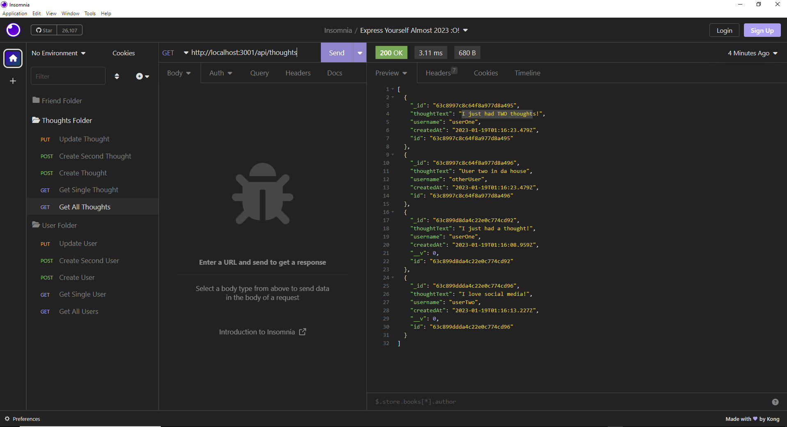

# Social-Network-Api

## Description

This app is meant to simulate a social media networks backend process. Using this app you can create users with a username and password. The users will be given a unique id to differentient between who makes each post or reaction. The posts in this socail network simulation app are called thoughts. Similar to a user, a thought has a unique identifier that is associated with the user id that created the thought. Both users and thoughts can both be created and upated as well as viewed collectivley or individually. My purpose in making this was to utilize mongoose to perform backend functions for a social network. Creating this project was a great way to learn more about mongoDb, mongoose and using controllers/routers/models and seed data. 

## Usage

screenshot:

Walkthrough Video Link:
[https://drive.google.com/file/d/1yroseJcjo07FoKkoj26ChmyJpWzj4V6p/view](https://drive.google.com/file/d/1yroseJcjo07FoKkoj26ChmyJpWzj4V6p/view)

## License
This project is licensed under the MIT license. https://choosealicense.com/licenses/mit/
